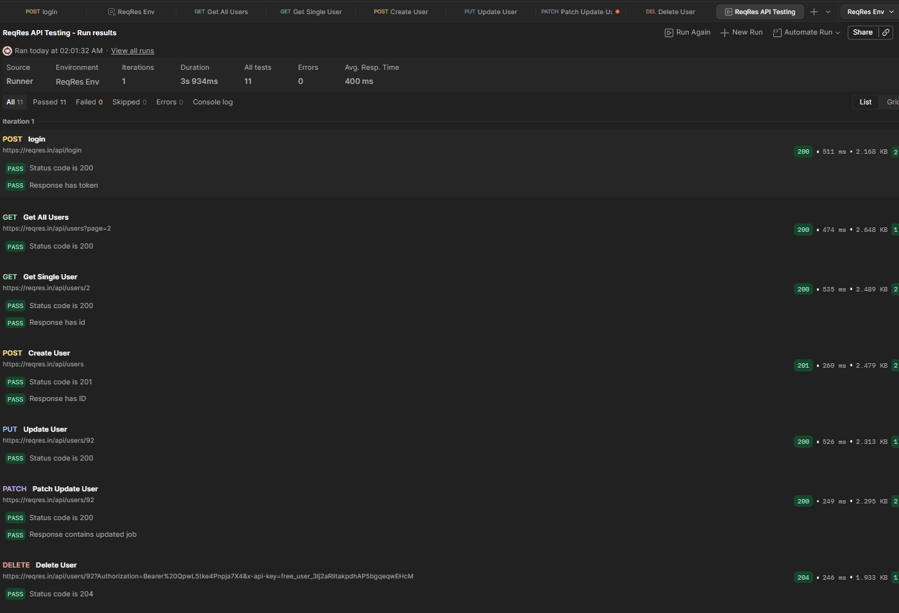

# API Testing Assignment — ReqRes API

**Author:** Grace UMWIZA 

## 1. API Choice and Base URL

**API used:** ReqRes
**Base URL:** `https://reqres.in/api`

ReqRes was chosen because it provides CRUD-style endpoints with predictable, well-documented responses, making it well suited for demonstrating authentication, all HTTP verbs, environment variables, and automated testing in Postman. The `/users` endpoints are demo/testing fixtures, so requests return the expected HTTP status codes and response shapes rather than persisting changes to a real database.

## 2. Authentication Method Used

**Method:** API Key + Login Token

Two authentication mechanisms were demonstrated:

- **API key** — sent as a header on `/users` requests, stored in the Postman environment variable `api_key` and referenced as `{{api_key}}`. A Pre-request Script attaches it automatically:

```
pm.request.headers.upsert({
    key: "x-api-key",
    value: pm.environment.get("api_key")
});
```

- **Login token** — obtained via `POST {{base_url}}/login`. A successful response returns a bearer token, which is not hardcoded anywhere — it's captured automatically and stored in the environment variable `auth_token`.

**Proof of authentication:** `POST {{base_url}}/login` was sent with a valid email/password body. A `200 OK` response containing a token confirms authentication is working correctly.

## 3. Endpoints Tested

| # | Request | Method | Endpoint | Purpose |
|---|---------|--------|----------|---------|
| 1 | Login | POST | `/login` | Authenticate and retrieve a bearer token |
| 2 | Get All Users | GET | `/users?page=2` | Retrieve a list of users |
| 3 | Get Single User | GET | `/users/{{user_id}}` | Retrieve a specific user |
| 4 | Create User | POST | `/users` | Create a new user |
| 5 | Update User | PUT | `/users/{{user_id}}` | Fully update a user |
| 6 | Patch Update User | PATCH | `/users/{{user_id}}` | Partially update a user |
| 7 | Delete User | DELETE | `/users/{{user_id}}` | Delete a user |

## 4. CRUD Operations — Explanation and Evidence

**GET — Read**
`GET {{base_url}}/users?page=2` retrieves a paginated list of users and returns `200 OK`. `GET {{base_url}}/users/{{user_id}}` retrieves a single user by ID, also returning `200 OK`.

**POST — Create**
`POST {{base_url}}/users` creates a new user. Request body:

```
{
  "name": "morpheus",
  "job": "leader"
}
```

A successful request returns `201 Created` along with the new user's `id` and a `createdAt` timestamp.

**PUT — Full Update**
`PUT {{base_url}}/users/{{user_id}}` replaces a user's full data. A successful update returns `200 OK` with the updated fields and an `updatedAt` timestamp.

**PATCH — Partial Update**
`PATCH {{base_url}}/users/{{user_id}}` updates only the specified field(s). Request body:

```
{
  "job": "Senior QA Engineer"
}
```

A successful update returns `200 OK`, and the response confirms the updated value.

**DELETE — Delete**
`DELETE {{base_url}}/users/{{user_id}}` removes the user. A successful deletion returns `204 No Content` (an empty response body is expected and correct).

## 5. Environment Variables and Automation

A Postman environment named **ReqRes Env** was created to store values reused across requests instead of hardcoding them:

| Variable | Purpose |
|----------|---------|
| `base_url` | `https://reqres.in/api` — used at the start of every request URL |
| `auth_token` | The bearer token returned from Login, used to demonstrate token-based auth |
| `api_key` | The API key used in the `x-api-key` header for `/users` requests |
| `user_id` | The ID of the user used by the Get Single User, Update, and Delete requests |

**Automation — saving the login token automatically:** rather than manually copying the token from the Login response, a test script was added to the Login request:

```
pm.test("Status code is 200", function () {
    pm.response.to.have.status(200);
});

pm.test("Response has token", function () {
    var jsonData = pm.response.json();
    pm.expect(jsonData.token).to.exist;
});

pm.environment.set("auth_token", pm.response.json().token);
```

This automatically extracts the `token` field from the response and saves it into `auth_token`, so any subsequent authenticated request can use `{{auth_token}}` with no manual steps in between.

**Automation — Pre-request Script:** a Pre-request Script was added to the Login request to automatically attach the current API key from the environment before the request is sent (shown in Section 2).

Test scripts were added to each request to verify correct behavior, for example on the Patch Update User request:

```
pm.test("Status code is 200", function () {
    pm.response.to.have.status(200);
});

pm.test("Response contains updated job", function () {
    var jsonData = pm.response.json();
    pm.expect(jsonData.job).to.eql("Senior QA Engineer");
});
```

## 6. Collection Runner

All seven requests (Login → Get All Users → Get Single User → Create User → Update User → Patch Update User → Delete User) were grouped into a single Postman Collection and executed in sequence using the Collection Runner, with the **ReqRes Env** environment selected. The run completed with **11/11 tests passed and 0 failures**:

| Request | Status | Test Result |
|---------|--------|--------------|
| Login | 200 | PASS |
| Get All Users | 200 | PASS |
| Get Single User | 200 | PASS |
| Create User | 201 | PASS |
| Update User | 200 | PASS |
| Patch Update User | 200 | PASS |
| Delete User | 204 | PASS |




## 7. Deliverables in This Repository

```
.
├── README.md
├── collection/
│   └── reqres-api.postman_collection.json
├── environment/
│   └── reqres-env.postman_environment.json
├── docs/
│   └── ReqRes-API-Testing_Reports.pdf
└── screenshots/
    └──09-test-results.png

```

**Note:** The exported environment file has all values (`base_url`, `auth_token`, `api_key`, `user_id`) left empty before being committed to this repository — no real credentials are included.

**Note on screenshots:** Full screenshots of every request/response (authentication, GET, POST, PUT, PATCH, DELETE, environment variables, and the Collection Runner run) are included in the separate written report submitted alongside this repository, rather than duplicated here.